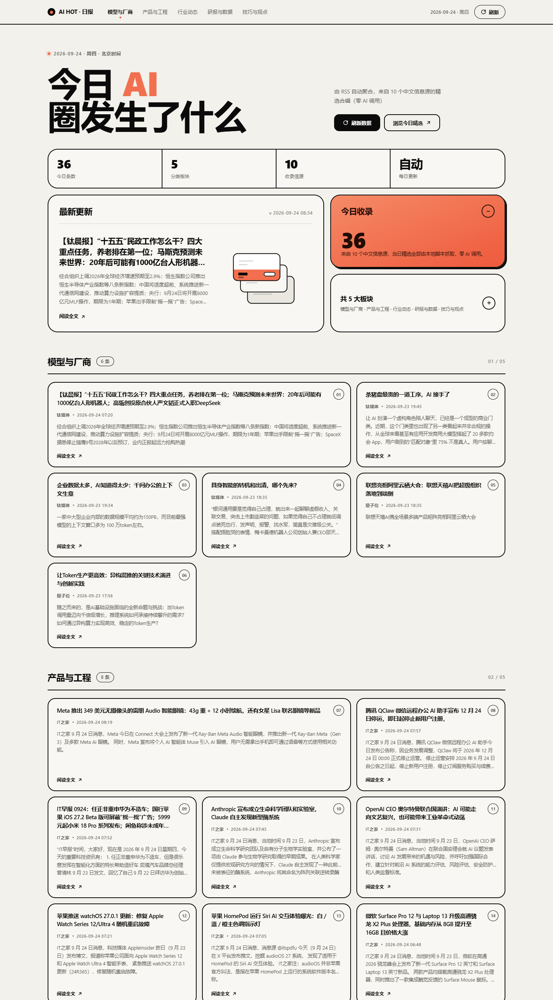
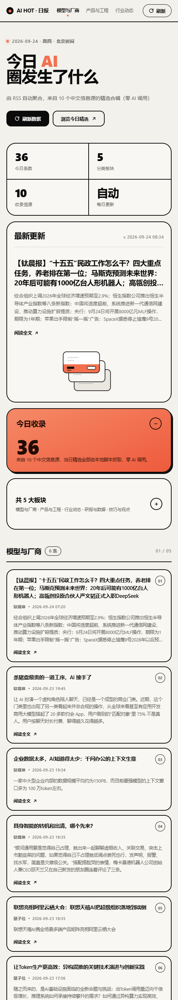

# AI 日报 HTML 看板

> **零 AI 调用、零 token 消耗**的每日 AI 资讯看板 —— 服务器每天 08:30 自动抓取
> **11 个全中文 RSS 源**，归类成 5 大板块，渲染成单文件 HTML，经 Cloudflare 隧道发布公网。

在线示例：**https://daily.forestkopa.top**




## 它解决什么问题

每天想看一圈 AI 圈发生了什么，得开十几个网站。这里把它压成一页：打开就是今天的内容，
按「模型与厂商 / 产品与工程 / 行业动态 / 研报与数据 / 技巧与观点」分好，点卡片直达原文。

整个过程**没有任何 AI 调用** —— 全靠 Python 抓 RSS + 模板拼接。所以零成本、零延迟，
且可完全离线复现（这也是它跟「让大模型总结新闻」那类方案的根本区别）。

> **关于生成物**：`dist_package/`（部署包）、`data/*.html`、`data/today.json`（抓取产物）、
> `preview/审计-*.json`（布局审计输出）都是**可重新生成的，不入库**。
> 克隆后跑一次 `更新看板.cmd` 即可重建。

## 目录

```
ai-daily-briefing/
├── fetch_rss.py                    RSS 抓取器：拉源 -> 过滤 -> 归类 -> 输出数据 JSON
├── build.py                        页面生成器：读 JSON -> 渲染 HTML（bankon 新粗野主义风格）
├── clean_cache.py                  归档缓存清理：滚动保留最近 N 天
├── make_deploy.py                  生成全量部署包（~8 MB，首次上线用，含 exe + nssm）
├── make_update.py                  生成服务器增量更新包（~37 KB，日常改代码用）
├── 更新看板.cmd                     双击即完整跑一遍（抓取+生成+归档+校验+清理+打开）
├── deploy/                         服务器部署相关
│   ├── server.js                   零依赖 Node 静态服务（含 /api/refresh 刷新链路）
│   ├── cli.py                      一条命令：抓取 -> 生成 -> 归档 -> 清理
│   ├── deploy-python.ps1           主部署脚本（Python/venv 路线，配 preflight 自检）
│   ├── deploy-nssm.ps1             备用部署脚本（exe 路线，服务器无需 Python）
│   ├── build_exe.py                PyInstaller 打包 exe
│   ├── diag-502.ps1                只读排障：定位 502 断在哪一段
│   ├── 部署手册.md                  完整部署 + 运维 + 回滚
│   └── Cloudflare_操作清单.md       隧道与 ingress 配置
├── tools/                          开发辅助：预览生成 / CDP 布局审计 / 产物与包校验
├── preview/                        UI 改版预览页与渲染截图
├── data/                           ← 抓取产物（除结构示例外不入库）
│   ├── today.json                  本次抓取的数据（每次覆盖）
│   ├── latest.html                 最新页面（固定入口，每次覆盖）
│   ├── <日期>.html                 当天归档副本（超过 30 天自动清理）
│   └── 2026-09-21.json             早期手工整理的数据（结构示例，入库）
├── dist_package/                   ← 生成物（不入库）部署包与更新包
├── sample_手工数据版_2026-09-21.html  最早那版手工数据的成品，留作版式参考
├── CHANGELOG.md
└── README.md
```

## 工作流

```
RSS 源（11个中文源）──> fetch_rss.py ──> data/today.json ──> build.py ──> data/latest.html
                          │                                                    │
                 AI 关键词 + 中文兜底 + 板块归类 + 去重              校验 -> 归档 -> 清理
```

**零 token**：全程只用 Python 抓取与模板拼接，没有任何 AI 调用。

## 用法

```bash
# 一键（推荐）：双击 更新看板.cmd
# 手动分步：
PYRSS="C:/Users/Administrator/.workbuddy/binaries/python/envs/rss/Scripts/python.exe"
PY="C:/Users/Administrator/.workbuddy/binaries/python/versions/3.13.12/python.exe"

"$PYRSS" fetch_rss.py --hours 48 -o data/today.json    # 抓取（默认 48 小时窗口）
"$PY"    build.py data/today.json -o data/latest.html  # 生成页面
"$PY"    clean_cache.py --days 30                      # 清理过期归档
```

`fetch_rss.py` 参数：
- `--hours N` 回溯小时数，默认 48
- `-o PATH` 输出 JSON
- `--limit N` 每板块最多条数（默认走内置配额）

`clean_cache.py` 参数：
- `--days N` 保留最近多少天归档，默认 30
- `--dir DIR` 指定归档目录（默认脚本同级 `data/`）
- `--dry-run` 只列出将删除的文件，不实际删除

## 更新到服务器（公网 daily.forestkopa.top）

线上部署在**公司 Win10 服务器**（Python 3.8.8），公网域名 `daily.forestkopa.top`。
完整部署方法见 `deploy/部署手册.md`。

**日常改动代码后，更新到线上只有两步：**

```powershell
# 1. 本地生成增量更新包（~37 KB）
python make_update.py

# 2. 把 dist_package\ai-briefing-update.zip 拷到服务器，解压后双击「更新.cmd」
```

增量包**只含 5 个源文件**，不含 `data/` `venv/` `logs/` —— 不可能误覆盖服务器数据。
更新脚本会自动备份旧版本，出问题可一键回滚（详见手册第 6 章）。

> ⚠️ 服务器是 **Python 3.8**：依赖必须钉版本，如 `feedparser==6.0.12`（6.0.13+ 要 Python ≥3.10）。

### 缓存清理规则

`clean_cache.py` **只删 `data/` 下符合 `<YYYY-MM-DD>.html` 命名的过期归档**：

| 保护对象 | 说明 |
|---|---|
| `latest.html` / `today.json` | 白名单，永不删 |
| `<日期>.json`（如 `2026-09-21.json`） | 命名不匹配归档规则，不删 |
| 源代码 / README / `.cmd` | 不在 `data/` 下，不删 |
| 非法日期命名 | 解析失败即跳过，不删 |

**两个触发点**（**均只在手工跑本地流程时生效**，日常出数已由服务器接管，见「定时更新」）：
1. `更新看板.cmd` 第 5 步，每次手动更新时顺带清理
2. 自动化任务「归档缓存清理（每周日 22:00）」独立兜底 —— **已暂停**

> 服务器侧不需要这两个：`cli.py` 自带 `--keep-days 30`，每天 08:30 顺手就清了。

**体积影响**：每天归档约 47 KB。不清理一年约 17 MB；保留 30 天则稳定在 **~1.4 MB**。

## 信息源（11 个，全中文，实测可用）

| 板块 | 来源 |
|---|---|
| 模型与厂商 | 量子位、钛媒体 |
| 产品与工程 | 开源中国、InfoQ 中文、IT之家 |
| 行业动态 | 雷峰网、Solidot、量子位 |
| 研报与数据 | 199IT |
| 技巧与观点 | 少数派、爱范儿、快科技 |

> **为什么去掉英文源**：原先 36 条里 19 条（52%）是英文，集中在模型发布、论文研究、
> 技巧与观点三块。但实测发现国内**没有**稳定的中文「模型发布 / 学术论文」RSS
> （机器之心 XML 坏、新智元/PaperWeekly/AI研习社 超时、arXiv 无中文版），
> 于是把板块名改为贴合中文源实际产出的内容，并用 199IT 的 AI 研报填「研报与数据」。
>
> **兜底机制**：`is_zh()` 按中文字符占比判定，命中即丢弃。即使某个源以后混入英文条目，
> 页面也不会出现英文。

### 已知失效/不可用的源（勿再尝试）

**英文源**（因「不要英文」已移除）：OpenAI News、Google DeepMind、Together AI、Ollama、
Qwen Blog、TechCrunch AI、The Verge AI、Wired AI、arXiv cs.AI / cs.CL、MIT Tech Review、
Hacker News、Lobsters AI、GitHub Trending。

**中文源探测失败清单**（两轮共探 67 个地址）：

| 源 | 症状 |
|---|---|
| 机器之心 `jiqizhixin.com/rss` | XML 格式错误 / 302 |
| 新智元、PaperWeekly、AI 研习社 | 连接超时（None） |
| AI 科技评论、智东西 | 500 |
| 36氪、品玩、华为开发者、火山引擎 | 200 但 0 条 |
| cnBeta、腾讯云开发者、阿里云开发者 | 302 |
| IT 桔子 | 412 |
| 智源社区、ModelScope、CSDN AI、掘金、SegmentFault | 404 |
| 中国人工智能学会、机器之心论文 | 404 |
| 虎嗅、V2EX、知乎热榜 | 超时 |
| GitHub Releases `.atom`（智谱/Qwen/DeepSeek） | RemoteDisconnected |

### 关于 199IT 的特殊处理

199IT 的 feed **不带日期**（只有 `附原数据表` 这类标题），所以在 `SOURCES` 里标了
`"no_date": True`，`fetch_source()` 会用当前时间兜底。这是它此前被静默丢弃的原因。

### 两个易踩的坑

1. **同一 feed 不要在两个板块重复引用**——`dedup()` 按标题去重，后引用的那份会被吃掉，
   导致某个板块莫名变空。所以量子位虽然同时出现在「模型与厂商」和「行业动态」，
   但靠 `max_per_source` 分成两批；爱范儿则只放在「技巧与观点」。
2. **无日期源要显式标 `no_date`**，否则会在 `dt is None` 那一步被全部丢弃。

### 间歇性不稳的源（已加重试）

少数派、爱范儿、快科技偶尔返回 0 条，`fetch_source()` 已内置 3 次重试
（间隔 1.5s / 3s）。仍失败则跳过，不影响整体。

## 数据格式

沿用原先的结构，`items` 每项多一个可选的 `date` 字段（RSS 采集时间）：

```jsonc
{
  "date": "2026-09-21",
  "weekday": "周一",
  "title": "今日", "subtitle": "圈发生了什么",
  "tagline": "...",
  "stats": [{ "num": 36, "label": "今日条数" }, ...],
  "footerSource": { "name": "...", "url": "..." },
  "generatedBy": "fetch_rss.py",
  "sections": [
    {
      "id": "sec-model", "name": "模型与厂商", "icon": "layers",
      "items": [{
        "title": "标题", "source": "来源名",
        "summary": "摘要正文", "url": "https://...",
        "date": "2026-09-21 11:46"      // 可选，有则显示在来源行
      }]
    }
  ]
}
```

## 抓取器的几个关键设计

**三级 AI 相关性判定**（`is_ai_related`）
全站源（IT之家、Solidot、HN）大量条目与 AI 无关，需要过滤：
1. 标题命中强信号词（人工智能、大模型、OpenAI、Claude…）→ 相关
2. 标题命中弱信号词（独立成词的 AI / A.I.）→ 相关
3. 正文命中强信号词 → 相关

三条路径都要先过 `FALSE_POSITIVE`（耳机、汽车、游戏移植…）排除，
避免「AI 耳机评测」「AI 语音车机」这类伪相关混入。

**摘要清洗**（`make_summary`）
卡片已有大标题，摘要只放正文，不重复标题。RSS 摘要质量参差，分情况处理：
- 占位符（InfoQ / 量子位的 description 只有「点击查看原文」）→ 触发 `fetch_article_lead()` 抓页面 og:description 或首段
- 以标题开头（arXiv / IT之家）→ `strip_title_prefix()` 裁掉重复前缀
- HN 的 `Article URL: ... Comments URL: ...` 机器格式 → 提取 Points 压成一句
- 全部失败 → 回落到「来自 X 的…，详情请见原文」

**文本清洗**（`clean_text`，在 `make_summary` 之前跑）

- **零宽/双向控制字符**（`ZW_RE`）：爱范儿、199IT 会在 description 里塞隐形水印。
  2026-09-24 实测 11 个源：爱范儿 99 个、199IT 454 个，其余 9 源为 0。
  这些属 Unicode **Cf 类**，`\s` 匹配不到，会在标题里留下「看不见的乱码」，
  影响复制 / 搜索 / 查重，必须单独剔一遍。
  ⚠️ `U+200C/U+200D` 是 **emoji 组合符**，只在确认是「散装水印」时才该剔 ——
  实测这 11 个源里它们全部相邻于其它格式字符，零误伤；
  将来接入带 emoji 的源需重新评估。另含 `U+00AD`（软连字符，同为隐形水印常用字）。
- **源站推广尾巴**（`PROMO_RE`）：爱范儿的 description 形如
  「正文。 #欢迎关注爱范儿官方微信公众号：爱范儿（微信号：ifanr），更多精彩内容第一时间为您奉上。」
  这 40 来字会吃掉 180 字摘要配额的两成，而且它排在末尾，**不处理时被 truncate 截掉的反而是正文**。
  剔除后若正文不足 20 字，会自动走 `fetch_article_lead()` 抓文章首段补内容，不会留空卡。

**板块配额**（`SECTION_CAP`）
防止全站源把某个板块撑爆（首版实测行业动态 46 条 vs 其他板块 0–14 条）：
模型 6 / 产品 8 / 行业 8 / 研报 6 / 技巧 8。

**低频板块放宽时间窗**
模型发布与研报都是低频产出（几周一条），在 48h 窗口下会空板。
`fetch_source()` 对 `sec-model` 与 `sec-paper` 强制用 14 天窗口。

**中文兜底**（`is_zh`）
按中文字符占比判定：标题 ≥12 字要求占比 ≥0.20，短标题 ≥0.40；
标题不达标时再看摘要前 200 字。信源已全换中文站，这道过滤是防漏网之鱼。

## 页面特性

界面为 **bankon 新粗野主义风格**：米白纸底 + 纯黑 2px 描边 + 硬投影（`4px 4px 0`）+ 珊瑚色点缀。
（2026-09-24 由原来的暖橙渐变风格改版而来，改版过程见 `preview/`。）

- 顶部胶囊导航：点击平滑滚动，滚动时自动高亮当前板块
- 首屏：巨型标题（`今日 AI / 圈发生了什么`）+ 右侧摘要 + 两个 CTA
- 数据条：4 格通栏（条数 / 板块 / 信源 / 更新频率），列数随 `stats` 条数自适应，小屏折成 2×2
- 焦点区三件套：`最新更新`（头条 + 线稿插画）、`今日收录`（珊瑚卡，突出总条数）、`共 N 大板块`
- 卡片错峰淡入：进入视口时逐张上浮出现
- 全局连续编号（01 → N）；板块标题右侧另有 `01 / 05` 进度标记
- 右下角回到顶部按钮
- **刷新按钮 ×2**（顶栏胶囊 + 首屏深色按钮，仅服务端模式可用）：POST `/api/refresh`
  让服务器重抓，前端轮询 `/api/status`，`state=ok` 后自动 `location.reload()`
- 响应式：≥1080px 保留左右分栏，<1080px 焦点区转单列，<720px 全单列 + 数据条 2×2
- 打印友好：隐藏导航浮层，卡片强制展开
- **降级保底**：`prefers-reduced-motion` 下关闭全部动效；卡片入场规则挂在
  `html.js-ready` 之下，JS 未执行时内容依然可见（详见下方「改版必读」）

### 刷新按钮的保护机制

| 机制 | 行为 |
|---|---|
| 单飞锁 | 已有抓取在跑时再点 → `429 {"reason":"busy"}` |
| 冷却 | 距上次成功 <`--cooldown`（默认 60s）→ `429 {"reason":"cooldown","retryAfter":N}` |
| 超时 | 单次抓取超 5 分钟 → 杀子进程，状态置 `error` |
| 降级 | `file://` 打开时按钮自动隐藏并提示需服务端支持 |

> 按钮**无鉴权**，谁都能刷（页面本身也没有鉴权）。要收紧就在 `server.js` 的
> `/api/refresh` 分支加 token 校验。

## 定时更新

> **定时跑在服务器上，不在开发机**（2026-09-24 起）。

正式流程由**服务器自己**完成：部署时 `deploy-python.ps1` 第 6 步注册了
Windows 计划任务 **`ai-briefing-update`（每天 08:30）**，跑的是
`D:\ai-daily-briefing\cli.py --out D:\ai-daily-briefing\data --keep-days 30`
—— 抓取、生成、归档、**自带 30 天清理**一条龙，与本节无关。

| 任务 | 位置 | 状态 |
|---|---|---|
| `ai-briefing-update`（每天 08:30） | **服务器**（计划任务） | ✅ 生效中 |
| AI 日报看板（每日 8:30 · RSS 零 token） | 开发机（WorkBuddy 自动化） | ⏸ 已暂停 |
| AI 日报看板 · 归档缓存清理（每周日 22:00） | 开发机（WorkBuddy 自动化） | ⏸ 已暂停 |

开发机上那两个 WorkBuddy 自动化**已暂停**（`d734a50b…` / `bd535504…`），原因是与
服务器计划任务**功能完全重复**：同是 08:30、同一套脚本（服务器额外自带清理）。
**开发机现在的定位是「开发环境」** —— 改代码、生成增量更新包，不再负责日常出数。

需要临时恢复本地出数（例如服务器宕机、或想本地预览改动效果）时，直接双击
`更新看板.cmd` 即可，不必重新启用自动化。

`clean_cache.py` 的两个触发点（`更新看板.cmd` 第 5 步、每周日自动化）也随之只在
**手工跑本地流程时**才起作用。

## 注意事项

- 生成器对所有文本做 HTML 转义，摘要里的引号尖括号安全
- 中文全部 UTF-8 无 BOM 写出
- `stats` 里 `num` 为整数才会做滚动动效（如 `"自动"` 则直接显示）
- 抓取依赖隔离 venv：`binaries/python/envs/rss`（内含 feedparser 6.0.14）
- **删除文件不要用 `os.remove` / `shutil.rmtree`** —— 本机有 safe-delete 钩子会拦截。
  正确做法是 ctypes 直调 `SHFileOperationW`（见 `clean_cache.py` 的 `permanent_delete()`）。
  注意：不加 `FOF_ALLOWUNDO` 是永久删除，加了才走回收站。
